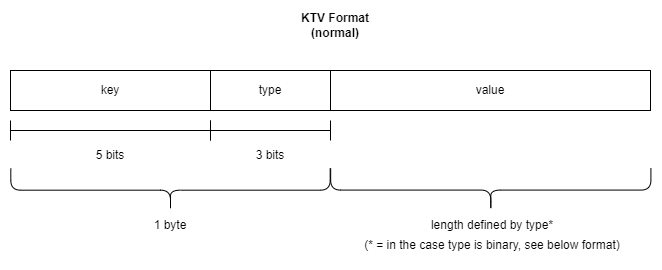

# Protocol Specification
The below outlines the protocol specification. Including packet format and any implementation requirements.

## Assumptions
* Datalink will indicate start of packet

## Justifications
* Meaningful values are 1-byte aligned to simplify the encoding and decoding
* Multi-byte values are big-endian to align with the [TCP/IP RFC 1700](https://www.rfc-editor.org/rfc/rfc1700) standard

# Packet Format

At its very core, the minimum requirement for a packet is:
* 1x Header
* \>= 1 key-type-value (KTV)

## Header

The header is always 1 byte and contains the following sections
* version
* rtr
* num_keys

Potential Changes
* Add preamble field

### Version
**Type:** 4-bit enum

**Description:** The version of the protocol this packet aligns to.

The versions are outlined below for verbosity.

| Version | Binary | Notes |
|---------|--------|-------|
| undef | 000 | Will match any packet with any version, used for development |
| 1 | 01 | 
| 2 | 10 |
| 3 | 11 |

### RTR

**Type:** 1-bit boolean

**Description:** Is this packet a request or not.

The remote-transmission-request (rtr) is a concept borrowed from the [CAN protocol remote frame](https://en.wikipedia.org/wiki/CAN_bus#Remote_frame), and allows the transmitter to send an empty-value packet with this rtr bit set. The receiver should then respond with the appropriate values.

In the context of FCAP, if a user wants to request data from a remote user, they should send a packet with the rtr-bit set and with the key-type bytes they are requesting. 

For example, if the user is requesting key 1 with type uint8, and key 6 with type uint16, the transmission would look as the following. Note, no value fields are included with the KTVs during an RTR transmission.

### Number of Keys

**Type:** uint5

**Description:** The number of KTVs within this packet. This, along with the rtr status, is used to determine the length of the packet.

## KTV

Each KTV contains a unique key, the data type of the value and the value itself. The key is unique amongst other keys, and must be one of the pre-defined keys outlined below. Any key can have any type. A key can only appear once in a given packet.

A non-binary typed KTV has the following packet format

 
A binary typed KTV has the following packet format

### Key

**Type:** uint5

**Description:** Unique key to identify information

There are 32 available unique keys for the user to use. 0-31 inclusive. Each key can only exist once in each packet.

### Type

**Type:** 3-bit enum

**Description:** The data type the following value should be interpreted as.

There are 8 types available for the user to use. These are outlined below. Note that the 0 type is binary and allows the user to send up to 2^8 number of bytes in a single value blob. Therefore, if the user used all 32 keys as binary, they would be able to send 32*2^8 number of bytes of user data. Both clients must be configured to support this.

| enum  (decimal) | enum (binary) | type| length (bytes) |
|-------|------|-----------|-----|
| 0     | 000  | binary    | N/A |
| 1     | 001  | uint8     | 1   |
| 2     | 010  | uint16    | 2   |
| 3     | 011  | int16     | 2   |
| 4     | 100  | uint32    | 4   |
| 5     | 101  | int32     | 4   |
| 7     | 110  | float     | 4   |
| 8     | 111  | double    | 4   |

### Value

**Type:** N/A

**Description:** The information associated with the preceding key.

Multi-byte values are sent in **big-endian** to match the [TCP/IP RFC 1700](https://www.rfc-editor.org/rfc/rfc1700)

Binary data is not manipulated from the user.